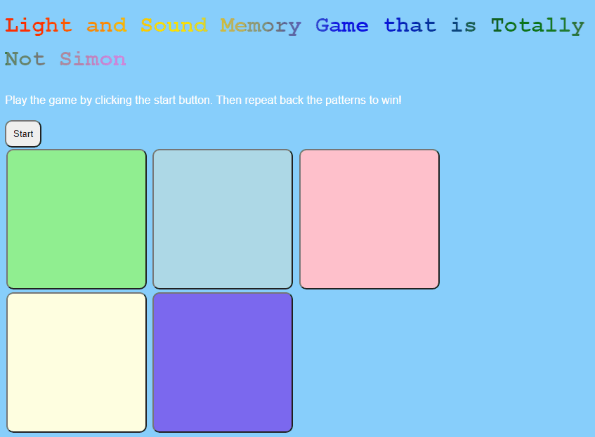
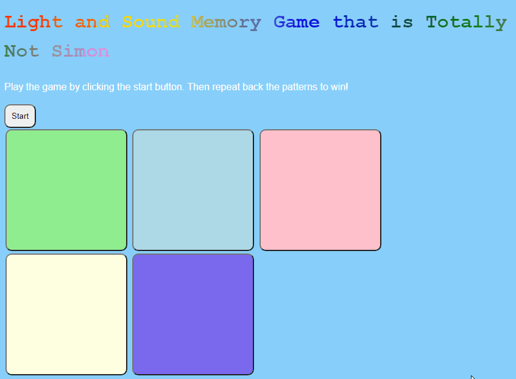

# Pre-work - *Memory Game*

**Memory Game** is a Light & Sound Memory game to apply for CodePath's SITE Program. 

Submitted by: **Joshua Rechkemmer**

Time spent: **4.5** hours spent in total

Link to project: https://amber-pentagonal-shad.glitch.me

## Required Functionality

The following **required** functionality is complete:

* [x] Game interface has a heading (h1 tag), a line of body text (p tag), and four buttons that match the demo app
* [x] "Start" button toggles between "Start" and "Stop" when clicked. 
* [x] Game buttons each light up and play a sound when clicked. 
* [x] Computer plays back sequence of clues including sound and visual cue for each button
* [x] Play progresses to the next turn (the user gets the next step in the pattern) after a correct guess. 
* [x] User wins the game after guessing a complete pattern
* [x] User loses the game after an incorrect guess

The following **optional** features are implemented:

* [x] Any HTML page elements (including game buttons) has been styled differently than in the tutorial
* [x] Buttons use a pitch (frequency) other than the ones in the tutorial
* [x] More than 4 functional game buttons
* [ ] Playback speeds up on each turn
* [x] Computer picks a different pattern each time the game is played
* [x] Player only loses after 3 mistakes (instead of on the first mistake)
* [ ] Game button appearance change goes beyond color (e.g. add an image)
* [ ] Game button sound is more complex than a single tone (e.g. an audio file, a chord, a sequence of multiple tones)
* [ ] User has a limited amount of time to enter their guess on each turn

The following **additional** features are implemented:

- [ ] List anything else that you can get done to improve the app!

## Video Walkthrough (GIF)

If you recorded multiple GIFs for all the implemented features, you can add them here:
### Memory Game Win

### Memory Game Lose

## Reflection Questions
1. If you used any outside resources to help complete your submission (websites, books, people, etc) list them here. 

I used W3Schools to reference the syntax for the languages and to make the color gradient for the header. developer.mozilla.org was used to get the syntax to make a random number within a range.

2. What was a challenge you encountered in creating this submission (be specific)? How did you overcome it? (recommended 200 - 400 words) 

A challenge I had was the change in languages. As with any new language, I didn't know the syntax, so I would experience some frustration since my usual way doesn't work exactly as I'm used to. I would get around this problem with syntax by referencing documentation or tutorials online. Besides the syntax, I am very used to Java and C++, so my instincts wanted me to somehow contain data and functionality into a class or some sort of container. I had trouble organizing the project, but I got around this problem by recalling Java swing libraries that would be touched on in my programming fundamentals courses. The way you would organize those components with the components in web development felt very similar to me, so once I made that connection, the organization of the project came a lot easier

3. What questions about web development do you have after completing your submission? (recommended 100 - 300 words) 

I am curious about the interactions between the 3 languages: HTML, CSS, and JavaScript. If I am understanding it correctly, I had put some CSS code in the HTML file to give the header the color gradient, so I'm unsure how exactly how the languages interact if one could be used in another's file. I've always heard that these 3 languages were the primary tools for web development and this could be the reason why.

4. If you had a few more hours to work on this project, what would you spend them doing (for example: refactoring certain functions, adding additional features, etc). Be specific. (recommended 100 - 300 words) 

I would like to add more features to the game. The main one would be some sort of indicator to let the player know that they clicked the wrong button with a noise, message box, text popup, or some other method to give the message. I also would've like to play with the sounds and looks of the game more. I wanted to look into putting in images or importing sounds, but I wanted to focus on the game features more.

## Interview Recording URL Link

[My 5-minute Interview Recording](your-link-here)

## License

    Copyright Joshua Rechkemmer

    Licensed under the Apache License, Version 2.0 (the "License");
    you may not use this file except in compliance with the License.
    You may obtain a copy of the License at

        http://www.apache.org/licenses/LICENSE-2.0

    Unless required by applicable law or agreed to in writing, software
    distributed under the License is distributed on an "AS IS" BASIS,
    WITHOUT WARRANTIES OR CONDITIONS OF ANY KIND, either express or implied.
    See the License for the specific language governing permissions and
    limitations under the License.
